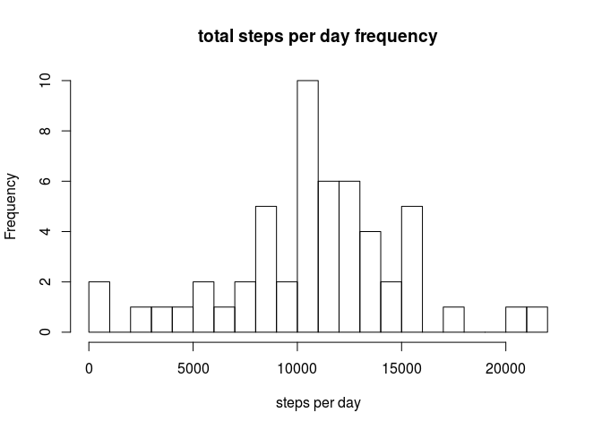
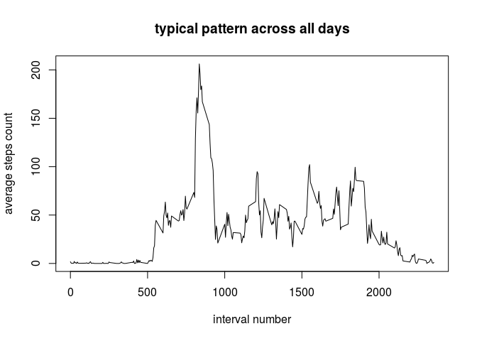

# Reproducible Research: Peer Assessment 1


## Loading and preprocessing the data

Since repository itself provide zip file, we will not download it from Internet.
If you don't have [data file](https://d396qusza40orc.cloudfront.net/repdata%2Fdata%2Factivity.zip) for some reason, you can download it.

Also, make note -- we will need plyr and ggplot2 packages, so make sure they are present. If not -- you should install them using ```install.packages```

Since data file is zipped -- we unzip it using `unz` function before read.

```r
data <- read.csv(unz("activity.zip", "activity.csv"))
head(data)
```

```
##   steps       date interval
## 1    NA 2012-10-01        0
## 2    NA 2012-10-01        5
## 3    NA 2012-10-01       10
## 4    NA 2012-10-01       15
## 5    NA 2012-10-01       20
## 6    NA 2012-10-01       25
```

Now lets check column classes and fix them if need

```r
str(data)
```

```
## 'data.frame':	17568 obs. of  3 variables:
##  $ steps   : int  NA NA NA NA NA NA NA NA NA NA ...
##  $ date    : Factor w/ 61 levels "2012-10-01","2012-10-02",..: 1 1 1 1 1 1 1 1 1 1 ...
##  $ interval: int  0 5 10 15 20 25 30 35 40 45 ...
```

```r
data$date <- as.Date(data$date, format="%Y-%m-%d")
```

Last step: since I'm russian, lets set locale to english to not fear you with cyrillic

```
## [1] "LC_CTYPE=en_US.UTF-8;LC_NUMERIC=C;LC_TIME=en_US.UTF-8;LC_COLLATE=en_US.UTF-8;LC_MONETARY=en_US.UTF-8;LC_MESSAGES=ru_RU.UTF-8;LC_PAPER=uk_UA.UTF-8;LC_NAME=C;LC_ADDRESS=C;LC_TELEPHONE=C;LC_MEASUREMENT=ru_RU.UTF-8;LC_IDENTIFICATION=C"
```

Ok, for now dataset is ready for manipulations.

## What is mean total number of steps taken per day?
For calculating this we summarize steps done within same date and then calculate mean value.


```r
steps_per_day <- aggregate(steps ~ date, data=data, FUN=sum)
```
Here is total steps per day frequency diagram.

```r
hist(steps_per_day$steps, xlab = 'steps per day', main = "total steps per day frequency", breaks=20)
```

 

Now we're ready to calculate mean and median values:

```r
mean(steps_per_day$steps, na.rm = TRUE)
```

```
## [1] 10766.19
```

```r
median(steps_per_day$steps)
```

```
## [1] 10765
```

## What is the average daily activity pattern?

To answer this question first we need to calculate average values for each interval

```r
steps_per_interval <- aggregate(steps ~ interval, data=data, FUN=mean)
```

Now lets plot the diagram.

```r
plot(steps_per_interval$interval, steps_per_interval$steps, type='l', ylab="average steps count", xlab='interval number', main='typical pattern across all days')
```

 

So the pattern looks like this: 

* almost no activity till 500th minute
* then steady increasing till 800th minute
* then rapid increase and immediate fall in interval 800 - 1000 min
* 'saw'-style activity till approx. 1900th minute
* then steady decrease

In general, looks like most steps are taken approximately at 850th-900th minute.
Lets check it:


```r
max_steps_index <- which.max(steps_per_interval$steps)
steps_per_interval$steps[max_steps_index]
```

```
## [1] 206.1698
```

```r
steps_per_interval$interval[max_steps_index]
```

```
## [1] 835
```
So, maximal steps count(206) achived at 835th interval

## Imputing missing values

Lets do quick analyze for missing values. First, check, how many NA values we have:


```r
missing <- sum(is.na(data$steps))
present <- sum(!is.na(data$steps))
percentage <- missing * 100 / (missing + present)
print(missing)
```

```
## [1] 2304
```

```r
print(percentage)
```

```
## [1] 13.11475
```
So, 13% of values is missing. Quite big value, lets emulate them, using median for this time interval across all days
(credential for this method goes to [stackoverflow auther](https://stackoverflow.com/questions/9322773/how-to-replace-na-with-mean-by-subset-in-r-impute-with-plyr))


```r
library(plyr)
impute.mean <- function(x) replace(x, is.na(x), mean(x, na.rm = TRUE))
data2 <- ddply(data, ~ interval, transform, steps = impute.mean(steps))
head(data2)
```

```
##       steps       date interval
## 1  1.716981 2012-10-01        0
## 2  0.000000 2012-10-02        0
## 3  0.000000 2012-10-03        0
## 4 47.000000 2012-10-04        0
## 5  0.000000 2012-10-05        0
## 6  0.000000 2012-10-06        0
```

Now rebuild frequency histogram and recalculate mean / median values:

```r
steps_per_day <- aggregate(steps ~ date, data=data2, FUN=sum)
mean(steps_per_day$steps, na.rm = TRUE)
```

```
## [1] 10766.19
```

```r
median(steps_per_day$steps)
```

```
## [1] 10766.19
```

```r
hist(steps_per_day$steps, xlab = 'steps per day', main = "total steps per day frequency", breaks=20)
```

 

So, while mean and median are left same (probably because NAs replaced with means), total average a bit different.
Our 'fix' moved total probability toward more equality, lowering most probable scenario and increasing less probable.

## Are there differences in activity patterns between weekdays and weekends?

To answer last question, first  add new column to our dataset, containing weekday name:

```r
data2$wd <- weekdays(data2$date, abbreviate = T)
data2$weekend <-  factor(data2$wd %in% c("Sun", "Sat"), levels=c(FALSE, TRUE), labels=c("weekday", "weekend"))
head(data2)
```

```
##       steps       date interval  wd weekend
## 1  1.716981 2012-10-01        0 Mon weekday
## 2  0.000000 2012-10-02        0 Tue weekday
## 3  0.000000 2012-10-03        0 Wed weekday
## 4 47.000000 2012-10-04        0 Thu weekday
## 5  0.000000 2012-10-05        0 Fri weekday
## 6  0.000000 2012-10-06        0 Sat weekend
```

Now calculate mean values for steps per each interval and plot the result,  separately for weekend and weekday:

```r
library(ggplot2)
steps_per_interval <- aggregate(steps ~ interval + weekend, data=data2, FUN=mean)
qplot(interval, steps, data=steps_per_interval, facets = weekend ~ ., col=weekend, geom = c("point", "path"))
```

 
